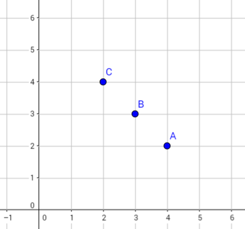
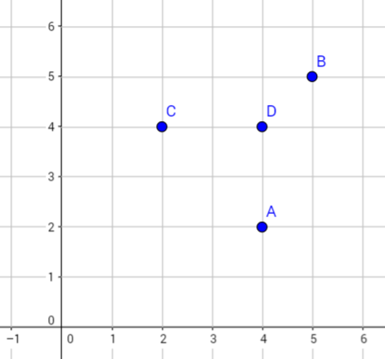

#ICPC Blog | Chennai '16 Regionals - Mancunian Candidate Master Forever#

[Original Problem](https://www.codechef.com/ACM16CHN/problems/CHN16B) | [Submit solutions here](https://www.codechef.com/problems/CHN16B)

This problem was set by Satyaki Upadhyay as identified by his trademark, the character "Mancunian" (as he is a big Manchester United fan). The crux of the problem is that Mancunian goes to a store with **N** "alcohols", where each alcohol is identified by the amount of sugar and salt present in it, and also has a price associated with it. The challenge is that Mancunian wants to be able to prepare each of the **N** alcohols, but he also want's to do so spending the least amount of money. What he can do instead, is to mix the few alcohols that he purchased, in any proportion to obtain the remaining alcohols that he didn't buy. The sugar and salt content in the newly prepared alcohol is the weighted mean of the sugar and salt contents from the constituent alcohols. We also assume that Mancunian must be just **able** to prepare all the variants and he need not necessarily actually prepare all of them.

At first glance the problem seems like a complex optimization problem involving linear programming. And so we were totally blank as to how to proceed. A typical remedy in such a case is to go through the provided examples.

In the first example the store has three variants - 4mg sugar + 2mg salt (₹1), 3mg sugar + 3mg salt (₹5), 2mg sugar + 4mg salt (₹10). If he buys all the alcohols he will incur a cost of ₹16. Is it possible to be able to prepare all these alcohols while not purchasing all of them. One possible solution is to just buy the 4mg sugar + 2mg salt and 2mg sugar + 4mg salt. Which can then be mixed in a 1:1 ratio to obtain the 3mg sugar + 3mg salt alcohol. This combination requires just ₹11 as compared to ₹16.

Now during the competition, we were thinking of a way to concisely express each of these alcohols so as to ease further discussion, and one natural way of doing so is representing 4mg sugar + 2mg salt alcohol as (4,2). Which immediately calls for the need to visualize the above example in a 2 dimensional cartesian coordinate system, which yields such the picture below, where A, B and C represent the alcohols (4,2), (3,3) and (2,4) respectively.

Combining that image with the ₹11 solution that we obtained above, we can see that using just (4,2) and (2,4) we can obtain any alcohol which lies on the segment joining these two points. For example mixing A and C in a 1:3 ratio we obtain (2.5,3.5) _(this is just for validating the concept as the problem only allows for integral quantities of sugar and salt)_. For those of you who remember high-school geometry, this construct is identical to internal division. Recall that internal division of a segment in a ratio _a_:_b_ can yield any point within the segment, where _a_ and _b_ are positive integers. Also recall that if any of _a_ or _b_ were negative it results in external division which yields points outside of the segment. Also notice the remarkable similarity between internal division and weighted mean - both the concepts are identical except that they are defined on different domains.

Now we can solve any case in which all the alcohols lie in a straight line. Just pick the end-points and we can prepare all the other alcohols. As an exercise, you can figure out how we are getting the right solution without even bothering about the cost of the alcohols _(Hint: Our primary aim is to be able to prepare all the alcohols and minimizing the total cost is secondary)_. From this point, for legibility we won't be considering the prices of the alcohols.

Stepping up the difficulty a notch let us now look at an example where the points are not colinear - (4,2), (5,5), (2,4), (4,4)

Invoking the fact that the location of the centroid of a triangle can be expressed as an average of its vertices i.e. weighted mean with all the weights set to 1. Extending the intuition a bit further, it can be shown that any point within a triangle can be expressed as a weighted mean of its vertices [[1]]&nbsp;[[2]].

Now we can solve any case where three of the points form a triangle which encloses the remaining points by reporting the three alcohols corresponding to the vertices as the solution. Excluding even one of these would mean that we would be unable to prepare that one using any combination of the rest.

Now we are ready to tackle the problem in all its generality. What is the general extension to a triangle - a square, a pentagon ... a polygon. If we are given a set of points such that a few of them form a polygon which encloses all the remaining points, then we can report the vertices of the polygon as our solution. For this to work we also require the polygon to be convex _(if it weren't, then we can obtain a smaller set of points which can enclose all the remaining points including some from the non-convex polygon)_. A proof of this comes from the fact that any polygon can be triangulated, and any point within the polygon must lie within exactly one of these triangles. As we have already seen, any point within a triangle can be expressed as a weighted mean of its vertices, and hence any point within this polygon can be expressed as a weighted mean of three of its vertices [[3]]. Consequentially this boils down to finding a convex hull for the given set of points, and the vertices forming the hull constitute the set of alcohols to purchase. If we take any other set of alcohols which isn't a superset of this set, it would be impossible to prepare at least on alcohol from this set, as it would be an exterior point for the polygon formed by the new set and reaching external points requires negative ratios which doesn't make sense in this scenario. And hence we are able to totally disregard the cost of the alcohols, as the convex hull is the minimal set of alcohols that we ought to purchase. And to keep the price to a minimum these are the only alcohols we purchase.

[1]: http://math.stackexchange.com/q/1485544/54513 (math stackexchange proof)
[2]: http://google.com (link to applet with triangular convex hull)
[3]: http://aditya95sriram.github.io/icpcblog-applet
